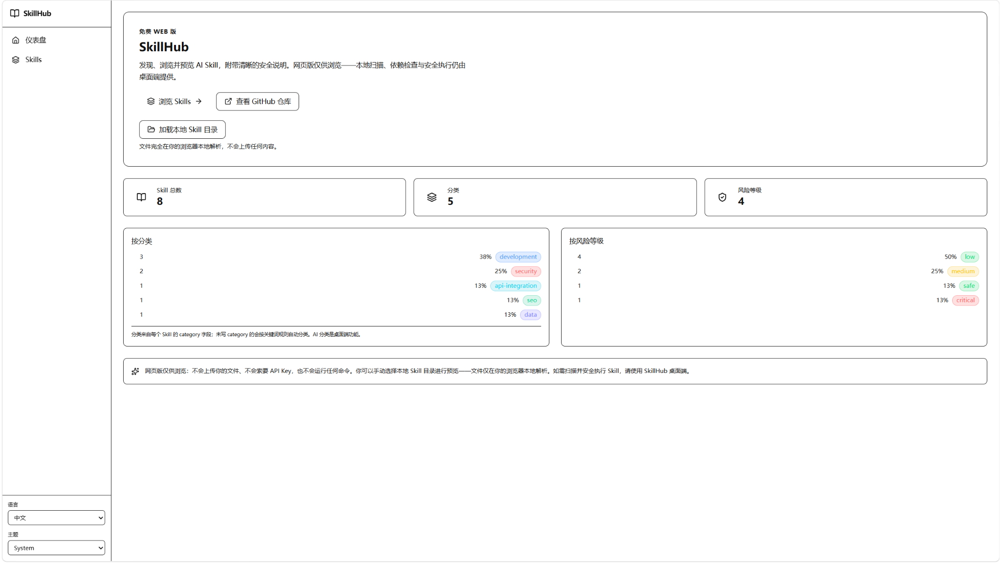
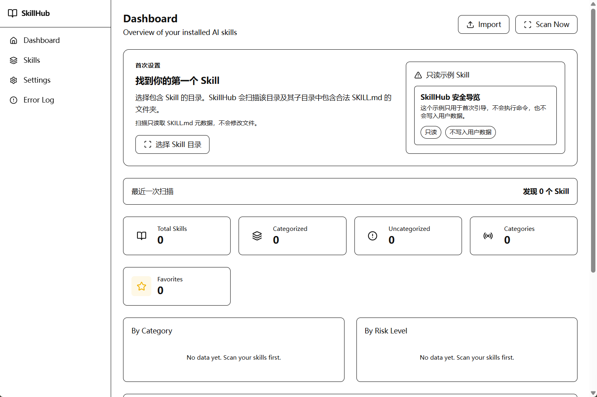
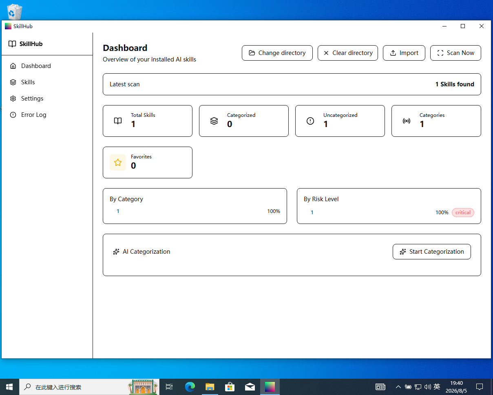

# SkillHub

Browse and understand AI Skills.

**[Open SkillHub Web](https://yyr-465.github.io/SkillHubs/)** — the primary public edition. Browse eight curated Skills, or choose a local Skill folder to read its `SKILL.md` files in your browser. No account or API key is needed.

- Browse, search, and filter Skills; inspect metadata and read Markdown content.
- Open a local folder on demand; the browser reads its `SKILL.md` files recursively without uploading the folder by default.
- Use English or Chinese UI and light or dark themes.

README AI translation infrastructure exists but is currently disabled on the public Web site because no real translation backend is configured.

   

## Web edition

The default Catalog contains eight Skills from `web-catalog/skills/`. You can also select a local folder: the browser reads its `SKILL.md` files recursively and displays them in place of the default Catalog for that session. Web does not automatically scan desktop Skill directories or store scans in SQLite. Local folder loading does not upload the folder. See [WEB.md](WEB.md) and [Privacy Policy](PRIVACY.md).

## Desktop edition

The separate Windows desktop application scans user-selected Skill directories, stores a catalog in SQLite, and supports review and controlled execution. Desktop feature development is paused while the Web edition is the primary public product.

> **Desktop release status:** SkillHub is pre-1.0. Existing public installers are updater-signed but are not yet Authenticode-signed. The production signing and release gate must be completed before they are presented as a trusted public release (see [Code signing policy](#code-signing-policy)).

### Desktop features

- Scan user-selected directories for explicit `SKILL.md` files.
- Browse, search, filter, tag, categorize, and favorite skills.
- Store catalog data locally in SQLite with full-text search.
- Import and export skill metadata.
- Optionally categorize skills through the DeepSeek API.
- Preview and run only explicitly declared skill executions.
- Require confirmation and enforce a narrow executable allowlist without invoking a shell.
- Cancel or time out managed executions and clean up their Windows process trees.
- Check, download, verify, and install signed application updates.
- Use English, Chinese, dark, light, system, or custom themes.

### Desktop quick start

1. **Install and launch SkillHub** from [GitHub Releases](https://github.com/yyr-465/SkillHubs/releases). Until production code signing completes, treat the installers as test builds (see [Installation](#desktop-installation)).

2. **Choose your skills folder.** On first launch the dashboard shows the onboarding state: no directory configured and no skills. Select the folder that contains your `SKILL.md` files — SkillHub scans it recursively and builds a local catalog. You can change or clear the directory later from the dashboard.

   

3. **Scan and explore.** Click *Scan now*; discovered skills appear on the dashboard, where you can search, filter, tag, categorize, and favorite them. Everything is stored locally in SQLite.

   

4. **Open a skill** to read its description, source metadata, and safety notes.

5. **Run a skill (optional).** Only skills with an explicit execution declaration offer a run action. Review the confirmation preview, then confirm. Commands run without a shell under a narrow executable allowlist, with a timeout and managed process-tree cleanup.

6. **Missing directory, empty folder, or missing dependencies?** Each state is explained in English and Chinese with actionable messages — for example, a preflight check tells you to install or add an executable to `PATH` before you run a skill.

To browse without installing, open [SkillHub Web](https://yyr-465.github.io/SkillHubs/).

## Documentation

- [Installation](docs/installation.md) — system requirements, install / update / uninstall, data directory.
- [Getting started](docs/getting-started.md) — first-use walkthrough: choose a folder, scan, browse, and run your first skill.
- [Safe execution](docs/safe-execution.md) — how skill execution is constrained and what it can and cannot do.
- [Backup & restore](docs/backup-restore.md) — protect your data and move to a new machine.
- [Known limitations](docs/known-limitations.md) — current limitations and their dispositions.
- [Data directory & backup reference](DATA_DIRECTORY.md) — formal data-location and backup-format reference.
- [Web edition](WEB.md) — scope, data source, and security notes for the Web build.
- [Privacy policy](PRIVACY.md) — network behavior and data handling.
- [Code signing policy](CODE_SIGNING_POLICY.md) — release provenance and signing roles.
- [Security policy](SECURITY.md) — how to report vulnerabilities.
- [Contributing](CONTRIBUTING.md) — development setup and contribution guidelines.

## Desktop platform

- Windows x64
- Tauri 2 and Rust backend
- React, TypeScript, and Vite frontend
- SQLite local data storage

## Desktop installation

Pre-release installers are available from [GitHub Releases](https://github.com/yyr-465/SkillHubs/releases).

Until the production code-signing gate is complete, these installers must be treated as test builds. A production release will include:

- Authenticode-signed NSIS and MSI installers
- Tauri updater signatures
- `latest.json`
- `SHA256SUMS.txt`
- release notes

To uninstall SkillHub, use **Windows Settings → Apps → Installed apps → SkillHub → Uninstall**. User data under `%USERPROFILE%\.skillhub` is intentionally kept outside the application installation directory and is not intentionally removed by the uninstaller.

## Data and network behavior

SkillHub has no developer-operated analytics or telemetry service. Web preferences and activity are stored in the browser; desktop catalog data, settings, history, and execution audit records are stored locally on the computer.

Desktop network access can occur in these cases:

- The user explicitly starts AI categorization, which sends skill names and descriptions to the DeepSeek API.
- The user explicitly checks for or downloads an update from GitHub Releases.
- A skill provides a remote icon URL, which the application WebView may request when displaying that skill.

Read the complete [Privacy Policy](PRIVACY.md) before using optional network features.

## Safe execution model

SkillHub does not infer commands from Markdown code blocks. A skill must contain an explicit execution declaration, and the user must review and confirm it before execution.

The backend validates the executable, arguments, working directory, and timeout; starts the program without a shell; bounds captured output; records a sanitized audit result; and manages process-tree cleanup.

This is a deliberately narrow safety boundary, not a general-purpose terminal or sandbox.

## Development

Prerequisites:

- Node.js 22
- pnpm 11
- Rust stable
- Windows build tools required by Tauri

Install dependencies and run the desktop application:

```powershell
pnpm install --frozen-lockfile
pnpm exec tauri dev
```

Run the required checks:

```powershell
pnpm run lint
pnpm run test:readme
pnpm run test:catalog
pnpm run test:worker
pnpm run typecheck:worker
pnpm run build
pnpm run build:web
cargo build --manifest-path src-tauri/Cargo.toml
cargo test --manifest-path src-tauri/Cargo.toml
```

Build a visibly labeled unsigned local QA installer without production updater metadata:

```powershell
pnpm run tauri:build:qa
```

## Web edition (build & deploy)

The Web edition is a static build of the same frontend. `web-catalog/skills/<id>/SKILL.md` is the editable source; committed `public/catalog/` is its generated snapshot for review and local preview. The Web build regenerates it and fails on invalid Skills:

```powershell
pnpm run build:web                  # regenerates public/catalog, then writes dist/
```

Preview locally (`scripts/serve-web.py` serves `.js` with the correct MIME type, unlike a plain `python -m http.server`):

```powershell
pnpm preview
# or: python scripts/serve-web.py
```

Deployment is automatic: pushing to `main` triggers `.github/workflows/pages.yml`, which checks the committed generated Catalog against the source before deploying. The GitHub Pages source must be set to "GitHub Actions". After Catalog edits, run `pnpm run build:web` and commit the updated `public/catalog/` snapshot. A manual fallback force-pushes a locally built `dist/` to the `gh-pages` branch:

```powershell
powershell -ExecutionPolicy Bypass -File scripts\deploy-gh-pages.ps1
```

See [WEB.md](WEB.md) for the Web edition's scope, data source, and security notes.

## Code signing policy

SkillHub's [Code signing policy](CODE_SIGNING_POLICY.md) defines release provenance, approvals, Authenticode signing, updater signing, verification, and maintainer roles. The [Privacy Policy](PRIVACY.md) documents all current network behavior.

Free code signing provided by [SignPath.io](https://signpath.io/), certificate by [SignPath Foundation](https://signpath.org/).

## Contributing

See [CONTRIBUTING.md](CONTRIBUTING.md) for development setup, required checks, commit guidelines, and security rules.

## Support and security

- Report reproducible bugs through [GitHub Issues](https://github.com/yyr-465/SkillHubs/issues).
- Do not include API keys, tokens, private keys, personal files, or sensitive paths in an issue.
- For a suspected security vulnerability, open a minimal issue requesting a private contact channel without publishing exploit details.

## License

SkillHub is licensed under the [MIT License](LICENSE).
